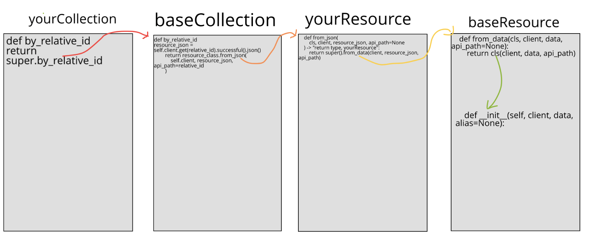
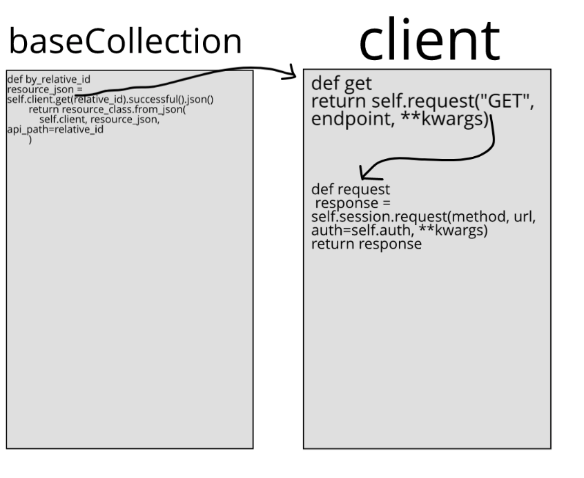

Contributor Guide
=================

.. _bug-reports-feature-requests:

🐛 Bug Reports / 🙋 Feature Requests
------------------------------------

Please leave bug reports and feature requests as `Github issues <https://github.com/Datatamer/tamr-client/issues/new/choose>`_ .

----

Be sure to check through existing issues (open and closed) to confirm that the
bug hasn’t been reported before.

Duplicate bug reports are a huge drain on the time of other contributors, and
should be avoided as much as possible.

↪️ Pull Requests
----------------

For larger, new features:

  `Open an RFC issue <https://github.com/Datatamer/tamr-client/issues/new/choose>`_ .
  Discuss the feature with project maintainers to be sure that your change fits with the project
  vision and that you won't be wasting effort going in the wrong direction.

  Once you get the green light 🚦 from maintainers, you can proceed with the PR.

Contributions / PRs should follow the
`Forking Workflow <https://www.atlassian.com/git/tutorials/comparing-workflows/forking-workflow>`_ :

  1. Fork it: https://github.com/[your-github-username]/tamr-client/fork
  2. Create your feature branch::

      git checkout -b my-new-feature

  3. Commit your changes::

      git commit -am 'Add some feature'

  4. Push to the branch::

      git push origin my-new-feature

  5. Create a new Pull Request

----

We optimize for PR readability, so please squash commits before and during the PR
review process if you think it will help reviewers and onlookers navigate your changes.

Don't be afraid to ``push -f`` on your PRs when it helps our eyes read your code.

Install
-------

This project uses ``poetry`` as its package manager. For details on ``poetry``,
see the `official documentation <https://poetry.eustace.io/>`_ .

  1. Install `pyenv <https://github.com/pyenv/pyenv#installation>`_::

      curl https://pyenv.run | bash

  2. Clone your fork and ``cd`` into the project::

      git clone https://github.com/<your-github-username>/tamr-client
      cd tamr-client

  3. Use ``pyenv`` to install a compatible Python version (``3.6`` or newer; e.g. ``3.7.3``)::

      pyenv install 3.7.3

  4. Set that Python version to be your version for this project(e.g. ``3.7.3``)::

      pyenv local 3.7.3

  5. Check that your Python version matches the version specified in ``.python-version``::

      cat .python-version
      python --version

  6. Install ``poetry`` as `described here <https://poetry.eustace.io/docs/#installation>`_::

      curl -sSL https://raw.githubusercontent.com/sdispater/poetry/master/get-poetry.py | python

  7. Install dependencies via ``poetry``::

      poetry install

Run tests
---------

To run all tests::

    poetry run pytest .

To run specific tests, see `these pytest docs <https://docs.pytest.org/en/latest/usage.html#specifying-tests-selecting-tests>`_ .

Run style checks
----------------

To run linter::

    poetry run flake8 .

To run formatter::

    poetry run black --check .

Run the formatter without the `--check` flag to fix formatting in-place.

Build docs
----------

To build the docs::

    cd docs/
    poetry run make html

After docs are build, view them by::

    cd docs/ # unless you are there already
    open -a 'Google Chrome' _build/html/index.html # open in your favorite browser

Editor config
-------------

`Atom <https://atom.io/>`_ :

- `python-black <https://atom.io/packages/python-black>`_
- `linter-flake8 <https://atom.io/packages/linter-flake8>`_

Overview of Resource and Collection interaction (from_json and from_data confusion)
-----------------------------------------------------------------------------------

`yourResource` and `yourCollection` are files that inherit from `baseResource` and `baseCollection`. Examples of such files would be `resource.py` and `collection.py` in the `attribute_configuration` folder under `project`.

**Step 1 (red)**: `yourCollection`’s `by_relative_id` returns `super.by_relative_id`, which comes from `baseCollection`

**Step 1a (black)**: within `by_relative_id`, variable `resource_json` is defined as `self.client.get.[etc]`. `Client`’s `.get` returns `self.request`

**Step 1b (black)**: `client`’s `.request` makes a request to the provided URL (this is the method actually fetching the data)

**Step 2 (orange)**: `baseCollection`’s `by_relative_id` returns `resource_class.from_json`, which is the `from_json` defined in `yourResource`

**Step 3 (yellow)**: `yourResource`’s `from_json` returns `super.from_data`, which comes from `baseResource`

**Step 4 (green)**: `baseResource`’s `from_data` returns `cls` , one of the parameters entered for `from_data`.
`cls` is a `yourResource`, because in `from_json` the return type is specified to be a `yourResource`.
When `cls` is returned, a `yourResource` that has been filled with the data retrieved in `client`’s `.request` is what comes back.
