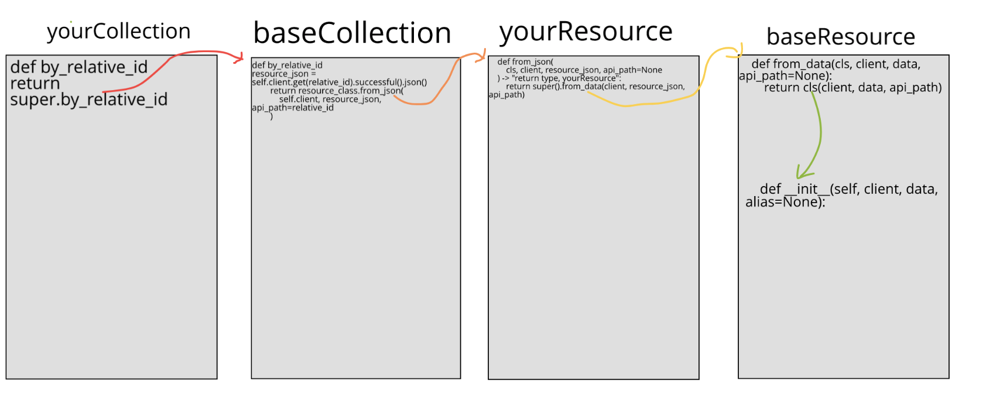
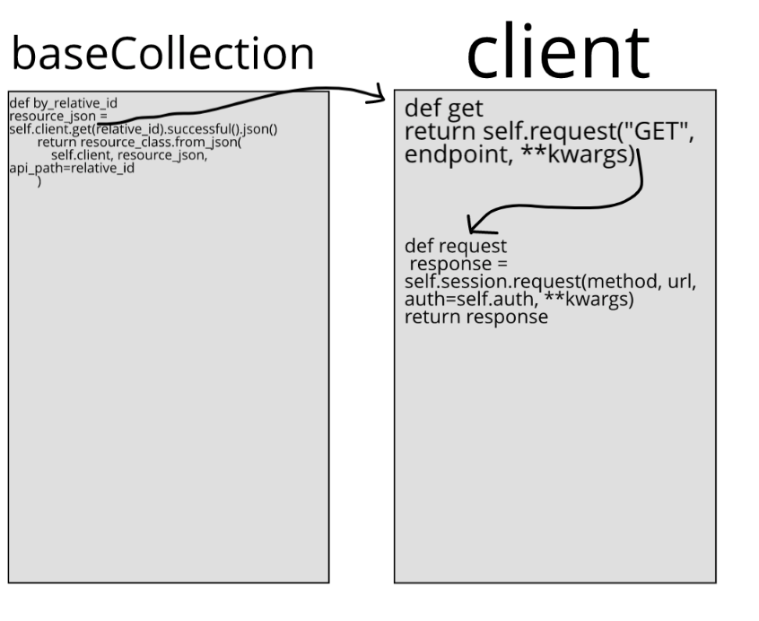

# Navigating Inheritance

Older parts of the codebase heavily use inheritance.
We are in the process of [migrating to `dataclasses`](https://github.com/Datatamer/tamr-client/issues/309) to simplify the codebase, but in the meantime you might want to know how the inheritance machinery we have works.

---

`yourResource` and `yourCollection` are files that inherit from `baseResource` and `baseCollection`. Examples of such files would be `resource.py` and `collection.py` in the `attribute_configuration` folder under `project`.

**Step 1 (red)**: `yourCollection`’s `by_relative_id` returns `super.by_relative_id`, which comes from `baseCollection`

**Step 1a (black)**: within `by_relative_id`, variable `resource_json` is defined as `self.client.get.[etc]`. `Client`’s `.get` returns `self.request`

**Step 1b (black)**: `client`’s `.request` makes a request to the provided URL (this is the method actually fetching the data)

**Step 2 (orange)**: `baseCollection`’s `by_relative_id` returns `resource_class.from_json`, which is the `from_json` defined in `yourResource`

**Step 3 (yellow)**: `yourResource`’s `from_json` returns `super.from_data`, which comes from `baseResource`

**Step 4 (green)**: `baseResource`’s `from_data` returns `cls` , one of the parameters entered for `from_data`.
`cls` is a `yourResource`, because in `from_json` the return type is specified to be a `yourResource`.
When `cls` is returned, a `yourResource` that has been filled with the data retrieved in `client`’s `.request` is what comes back.
